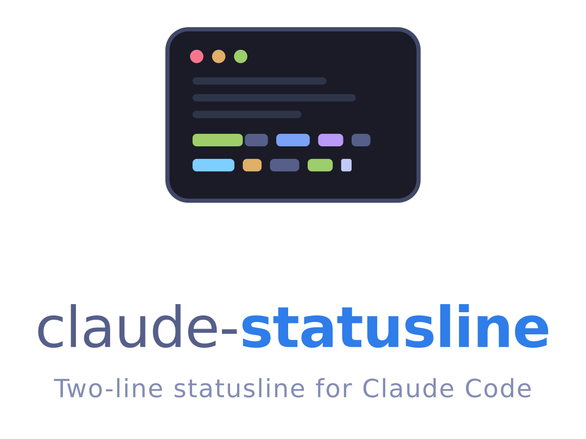

<!-- markdownlint-disable-file MD033 MD041 -->
<div align="center">
  <picture>
    <source media="(prefers-color-scheme: dark)" srcset="assets/logo-dark.png">
    
  </picture>
</div>

A two-line statusline for [Claude Code](https://code.claude.com), rendered in the
[Tokyo Night](https://github.com/folke/tokyonight.nvim) palette: context usage, token and
prompt-cache metrics, model and effort level on the first line; project, git status, and pull
request context on the second.

## Features

- Two fixed lines: context bar, absolute context tokens, token counts, prompt-cache hit ratio,
  cache age, model, and effort level on top; project, git branch with repo name, stash, sync,
  operation state, worktree indicators, and the open pull request below
- Tokyo Night palette rendered as 24-bit truecolor, identical in every terminal;
  `NO_COLOR` respected
- Chips hide themselves when their data is absent: a clean repo shows a short line, a merge
  conflict or a cold prompt cache stands out
- Clickable branch and pull request chips (OSC 8 hyperlinks, on by default)
- Width-aware: adapts to the terminal width reported by Claude Code, dropping the least
  important chips first
- Single native binary; renders in a few milliseconds with no caches or background processes

## Requirements

- Claude Code 2.1.153 or newer
- `git` on PATH for the repository chips
- A Rust toolchain to build (no runtime dependencies)

## Installation

```bash
cargo build --release
./target/release/claude-statusline --setup
```

The wizard shows a preview and writes the `statusLine` entry (with a `refreshInterval` of 10
seconds, which keeps the cache-age chip live) into `~/.claude/settings.json`, backing up the
previous configuration. Restart Claude Code afterwards. For a non-interactive install use
`--install`; check the result with `--print-config`.

## Configuration

Optional file `~/.claude/claude-statusline.json`:

```json
{
  "clickable_links": true,
  "disabled_sections": ["cache_age"]
}
```

`clickable_links` toggles the OSC 8 hyperlinks. `disabled_sections` hides chips by name:
`bar`, `context_tokens`, `tokens`, `cache`, `cache_age`, `model`, `effort`, `project`,
`branch`, `git_stash`, `git_sync`, `git_state`, `git_worktree`, `pr`, `worktree`.

## Uninstall

```bash
claude-statusline --uninstall
```

This removes the `statusLine` entry and restores the previous configuration when a backup
exists.

## License

Released under the MIT license. See [`LICENSE`](LICENSE) for the full text.
