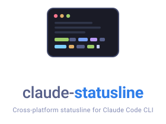
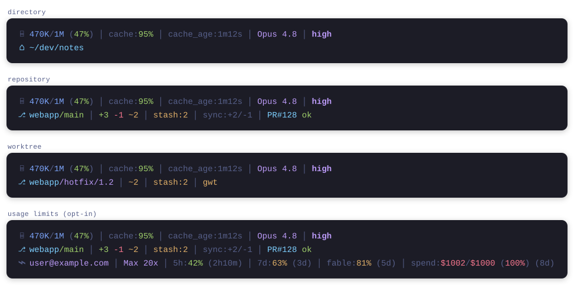
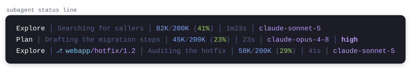
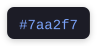
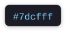
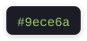
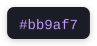
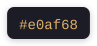
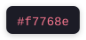
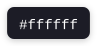

<!-- markdownlint-disable-file MD033 MD041 -->
<div align="center">
  <picture>
    <source media="(prefers-color-scheme: dark)" srcset="assets/logo-dark.svg">
    
  </picture>
</div>

A cross-platform statusline for the [Claude Code](https://code.claude.com) CLI: context usage,
token and prompt-cache metrics, model and effort level on the first line; working directory,
git status, and pull request context on the second; optionally, subscription usage limits on a
third.

<div align="center">
  <picture>
    <source media="(prefers-color-scheme: dark)" srcset="assets/statusline-dark.svg">
    
  </picture>
</div>

## Features

- Two fixed lines: context bar, absolute context tokens, token counts, prompt-cache hit ratio,
  cache age, model, and effort level on top; working directory, git branch with repo name,
  working tree file counts, stash, sync, operation state, worktree indicators, and the open
  pull request below
- 24-bit truecolor rendering, identical in every terminal regardless of its palette;
  `NO_COLOR` respected
- Chips hide themselves when their data is absent: a clean repo shows a short line, a merge
  conflict or a cold prompt cache stands out
- Cache age is flagged against the prompt-cache TTL the session actually requested, read from
  the transcript, so the chip warns as the real expiry approaches instead of at a fixed mark
- Clickable branch and pull request chips (OSC 8 hyperlinks, on by default)
- Width-aware: adapts to the terminal width reported by Claude Code, dropping the least
  important chips first
- Optional subagent status line: while agent tasks run, one row per task with
  name, live activity, context usage, elapsed time, and model
- Optional usage limits line (off by default): the account email, plan type, session
  and weekly window utilization with reset countdowns, the Fable-only weekly window,
  and the extra-usage spend meter; behind CLIProxyAPI one row per account that serves
  the session, each with the model it served last
- Opt-in update notification (off by default): a chip on the first line when a newer
  release is published, linking to its release notes
- Single native binary; renders in a few milliseconds. Only the opt-in usage limits line
  and update check keep small on-disk snapshots, refreshed by short-lived background fetches

## Requirements

- Claude Code 2.1.153 or newer; the per-task model and context fields of the
  subagent status line need 2.1.205 or newer
- `git` on PATH for the repository chips
- A Rust toolchain to build (no runtime dependencies)

## Installation

```bash
cargo build --release
./target/release/claude-statusline --setup
```

The wizard shows a preview and writes the `statusLine` entry (with a `refreshInterval` of 10
seconds, which keeps the cache-age chip live) into `~/.claude/settings.json`, backing up the
previous configuration. Restart Claude Code afterwards. For a non-interactive install use
`--install`; check the result with `--print-config`.

The wizard also offers the optional subagent status line, which renders one
row per running agent task in the agent panel:

<picture>
  <source media="(prefers-color-scheme: dark)" srcset="assets/statusline-subagent-dark.svg">
  
</picture>

Rows adapt to the panel width, shortening and then hiding the activity text
before dropping chips. On Claude Code versions without per-task model data
the metric chips hide and rows fall back to name, activity, and elapsed time.
A location chip after the task name shows where a task runs when that differs
from the session: the repo and branch inside a git repository (worktree
isolation shows up as its branch), otherwise the folder name. For a
non-interactive install use `--install --with-subagent-statusline`.

## Usage limits line

An opt-in third line shows the subscription limits otherwise hidden behind `/usage`: the
account email, the plan type, the five-hour session and weekly windows with reset countdowns,
the Fable-only weekly window, and the extra-usage spend meter (which also covers
Team/Enterprise spend limits). The wizard asks about it, or set `advanced_usage_limits_enabled`
yourself. The line renders only for native Anthropic subscriptions: Bedrock, Vertex, and
custom-gateway sessions (a non-Anthropic `ANTHROPIC_BASE_URL` or an `ANTHROPIC_AUTH_TOKEN`)
hide it unless the Claude Code payload still reports Anthropic rate limits, or a status from
the CLIProxyAPI plugin route makes the same case (see "Behind CLIProxyAPI" below).

Session and weekly values come live from the Claude Code payload. The per-model and spend
data comes from an unofficial claude.ai endpoint, fetched in the background at most every
`usage_fetch_interval_seconds` (default 60, `0` disables the fetch) into
`~/.claude/claude-statusline-usage.json`. That endpoint may change without notice; when it
does, the affected chips disappear silently while the payload-backed chips keep working.

The account email and the plan come from the claude.ai profile endpoint, fetched by the same
background process at most once a day; until the first fetch lands, and with the fetch
disabled, they come from `~/.claude.json`. The account chip puts your email on screen;
`disabled_sections: ["usage_account"]` hides it.

### Behind CLIProxyAPI

With `cli_proxy_usage_enabled` set, a session whose `ANTHROPIC_BASE_URL` points at a
[CLIProxyAPI](https://github.com/router-for-me/CLIProxyAPI) instance that runs the
[cpa-claude-statusline](https://github.com/flobernd/cpa-claude-statusline) plugin gets the line
from that plugin instead. A detached child polls
`<base-url>/v0/resource/plugins/cpa-claude-statusline/session?id=<session-id>` every
`cli_proxy_usage_refresh_seconds` (default 5, the floor) into
`~/.claude/claude-statusline-sessions/<session-id>.json`, and each render tick reads that file;
the tick never waits on the network. An answer older than a minute is not shown. Files of
sessions that ended are removed a day later.

The proxy binds a session to a credential per model, so the main model, the auxiliary calls
Claude Code makes on a smaller model, and a subagent on another model can each run on an
account of their own. The plugin publishes every account that served the session, and the line
renders one row per account, the most recently used on top, capped by
`cli_proxy_usage_max_accounts` (default 3). Each row shows the account (`usage_account`, the
email in magenta), its plan, the 5h, 7d, and Fable windows, the spend, and the model it served
last (`usage_model`), by model id, alias suffix included.

The claude.ai fetch and its cache are not used in that mode, because the local login is not
the account behind the proxy. Without the plugin the route answers 404 and the line stays
hidden, as it does for any other custom endpoint.

## Update notification

An opt-in chip at the end of the first line appears when a GitHub release newer than the
running binary is published, showing the new version and linking to its release notes.
Notification only: updating stays `git pull` plus `cargo build --release`. The wizard asks
about it, or set `update_check_interval_minutes` yourself (`1440` checks daily, `0`
disables); for a non-interactive install use `--install --with-update-check`. When enabled,
the statusline sends an anonymous request to `api.github.com` at most once per interval,
fetched by a short-lived background process into `~/.claude/claude-statusline-update.json`.
On a narrow terminal the chip is the first to give way, and it disappears on its own after
an update.

## Configuration

Optional file `~/.claude/claude-statusline.json`:

```json
{
  "advanced_usage_limits_enabled": false,
  "cli_proxy_usage_enabled": false,
  "cli_proxy_usage_max_accounts": 3,
  "cli_proxy_usage_refresh_seconds": 5,
  "clickable_links": true,
  "disabled_sections": ["cache_age"],
  "subagent_disabled_sections": ["activity"],
  "update_check_interval_minutes": 1440,
  "usage_fetch_interval_seconds": 60
}
```

`clickable_links` toggles the OSC 8 hyperlinks. `disabled_sections` hides chips by name:
`context_tokens`, `cache`, `cache_age`, `model`, `effort`, `update`, `cwd`, `branch`,
`git_files`, `git_stash`, `git_sync`, `git_state`, `git_worktree`, `pr`, `worktree`,
`usage_account`, `usage_plan`, `usage_session`, `usage_week`, `usage_fable`, `usage_spend`,
`usage_model`.

`subagent_disabled_sections` does the same for the subagent rows:
`name`, `cwd`, `branch`, `activity`, `context_tokens`, `elapsed`, `model`, `effort`.

Every `git` call gets a 500 ms budget so a hung repository can never stall a render.
`CLAUDE_STATUSLINE_GIT_TIMEOUT_MS` raises it for machines where process spawning alone can
approach that, such as a busy CI runner; an unusable value keeps the default.

## Colors

Every chip is painted from one fixed 24-bit palette, so a color means the same thing wherever it
appears. Labels, separators and low-salience values stay in the muted comment tone; a chip only
takes a saturated color when its value carries information.

| Name | Hex | Role |
| --- | --- | --- |
| Comment | <picture><source media="(prefers-color-scheme: dark)" srcset="assets/swatch-comment-dark.svg"></picture> | Labels, separators, and values needing no attention |
| Blue | <picture><source media="(prefers-color-scheme: dark)" srcset="assets/swatch-blue-dark.svg"></picture> | Token counts |
| Cyan | <picture><source media="(prefers-color-scheme: dark)" srcset="assets/swatch-cyan-dark.svg"></picture> | Locations and identifiers: directory, repo, pull request |
| Green | <picture><source media="(prefers-color-scheme: dark)" srcset="assets/swatch-green-dark.svg"></picture> | Healthy, default, or additive |
| Magenta | <picture><source media="(prefers-color-scheme: dark)" srcset="assets/swatch-magenta-dark.svg"></picture> | Identity, and being off the default: model, plan, feature branch, raised effort |
| Amber | <picture><source media="(prefers-color-scheme: dark)" srcset="assets/swatch-amber-dark.svg"></picture> | Worth noticing |
| Red | <picture><source media="(prefers-color-scheme: dark)" srcset="assets/swatch-red-dark.svg"></picture> | Needs attention, or destructive |
| White | <picture><source media="(prefers-color-scheme: dark)" srcset="assets/swatch-white-dark.svg"></picture> | Subagent task name |

Anything measured as a percentage of a budget shares one fill scale, so context, usage windows and
spend all read alike: green at 60% or below, amber below 85%, red from 85% up.

The tables below follow the render order of each line rather than an alphabetical one, so they read
in the same order as the statusline itself.

### First line

| Chip             | Coloring                                                                     |
| ---------------- | ---------------------------------------------------------------------------- |
| `context_tokens` | Counts blue, glyph and punctuation comment; the percentage takes the fill scale |
| `cache`          | Label comment, hit ratio always green                                        |
| `cache_age`      | Label comment; the age is comment while fresh, amber as expiry nears, red once expired, against the session's cache TTL (below) |
| `model`          | Magenta                                                                      |
| `effort`         | Bold magenta at `high`, `xhigh`, and `max`; bold comment at `low` and `medium`; hidden otherwise |
| `update`         | Amber: a new release is worth noticing but is not an error                  |

The `cache_age` thresholds follow the prompt-cache TTL the session actually requested, read from the
most recent cache write in the transcript. Turns that only read the cache name no TTL, and providers
other than Anthropic do not report one at all; either way the chip keeps the wider default.

| Cache TTL    | Comment   | Amber           | Red         |
| ------------ | --------- | --------------- | ----------- |
| 5 minutes    | under 4m  | 4m to under 5m  | 5m and over |
| 1 hour       | under 50m | 50m to under 1h | 1h and over |
| Not reported | under 5m  | 5m to under 1h  | 1h and over |

A negative age, meaning the transcript timestamp sits ahead of the clock, hides the chip entirely.

### Second line

| Chip           | Coloring                                                                       |
| -------------- | ------------------------------------------------------------------------------ |
| `cwd`          | Cyan; renders only outside a git repository. Red when the directory itself no longer exists |
| `branch`       | Repo name cyan; the branch green on a default branch, magenta on any other. Entirely red when the working directory no longer exists, with the identity taken from the Claude Code worktree payload |
| `git_files`    | `+added` green, `-removed` red, `~changed` amber                               |
| `git_stash`    | Amber                                                                          |
| `git_sync`     | Comment: ahead and behind counts are informational, not a problem               |
| `git_state`    | Bold red for `conflict`, bold amber for `merge`, `rebase`, `cherry-pick`, and `revert` |
| `git_worktree` | Amber                                                                          |
| `pr`           | `PR#N` cyan, then the review state: `ok` green, `chg` red, `rev` amber, `draft` comment |
| `worktree`     | Amber                                                                          |

### Usage limits line

Every chip here pairs a comment label with a value on the fill scale, so the line reads as a row of
meters: the further into a budget, the warmer the number.

| Chip            | Coloring                                                                      |
| --------------- | ------------------------------------------------------------------------------ |
| `usage_account` | Magenta; the email of the account behind the line                              |
| `usage_plan`    | Magenta, matching the model chip above it                                       |
| `usage_session` | Label `5h:` comment, percentage on the fill scale                               |
| `usage_week`    | Label `7d:` comment, percentage on the fill scale                               |
| `usage_fable`   | Label `fable:` comment, percentage on the fill scale                            |
| `usage_spend`   | Label `spend:` comment; both dollar amounts and the percentage on the fill scale |
| `usage_model`   | Magenta; the model id                                                          |

Reset countdowns are comment throughout, as is the leading glyph that marks the line.

### Subagent rows

The task `name` is white and `activity` and `elapsed` are comment. The `cwd`, `branch`,
`context_tokens`, `model`, and `effort` chips use exactly the rules above.

### Default branch detection

The branch chip turns green on a default branch and magenta on anything else, so a glance tells you
whether you are on a trunk or on your own work.

Rather than assuming the trunk is called `main` or `master`, the default branch is read from the
`HEAD` symref each remote publishes, which is what `git clone` records and what
`git remote set-head` refreshes. A repository whose trunk is `develop` or `trunk` is recognized, and
so is one whose only remote is not named `origin`. Every remote counts, so in a fork whose
`upstream` still uses `master` while `origin` has moved to `main`, both branches read as default.

When no remote publishes a `HEAD`, the chip falls back to treating `main` and `master` as default.

## Uninstall

```bash
claude-statusline --uninstall
```

This removes the `statusLine` and `subagentStatusLine` entries installed by claude-statusline
and restores the previous configuration when a backup exists.

## License

Released under the MIT license. See [`LICENSE`](LICENSE) for the full text.
